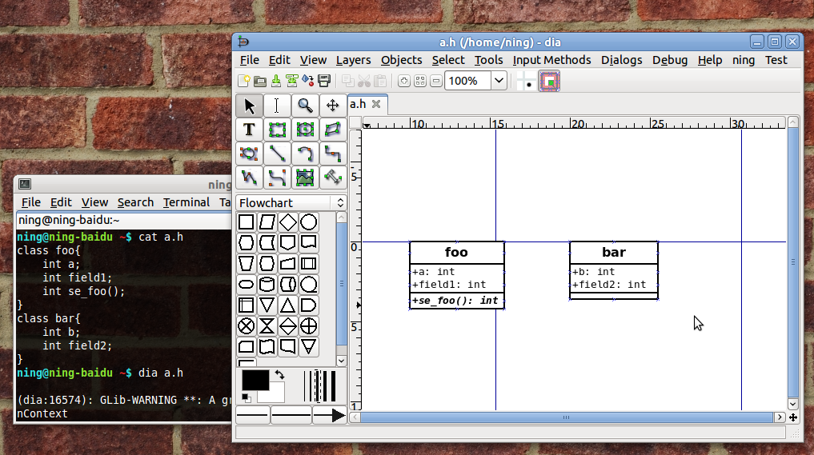
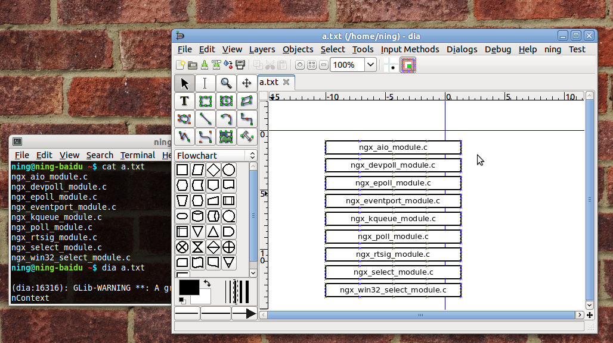
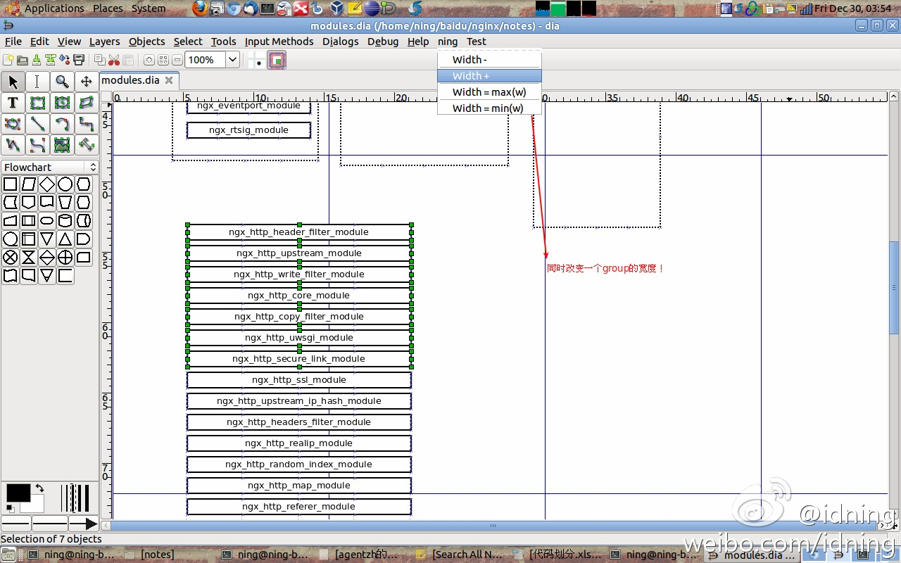

idning's dia-plugins
====================

usage::

    mkdir ~/.dia/python/
    cp python/* ~/.dia/python/

c2dia
-----

write a ``.h`` file with c struct definition, open this .h file with dia, change to UML class diagram

lines2dia
---------

write a txt file, change to boxes with same widht

adjust-width
------------

adjust width of a group of objects

